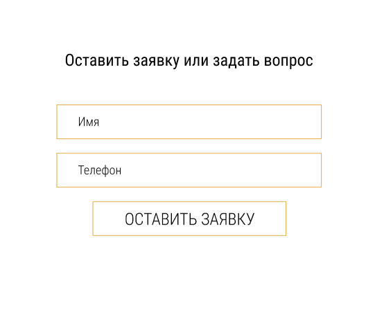
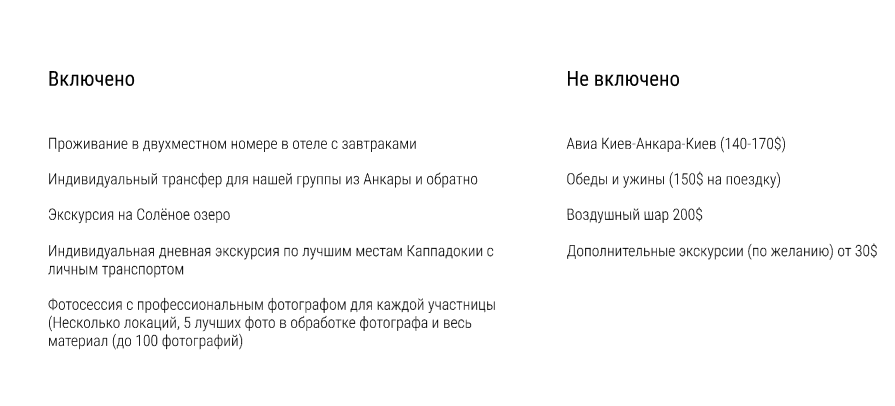

# LAB 1 `BEM`

## HUMAN BODY

```
.head
.head__eyes
.head__eye

.eye
.eye--closed


.body__neck
.body__arms
.body__arm

.arm
.arm__elbow
.arm__hand

.hand
.hand--clenched // сжатая кисть руки

.legs__leg

.leg
.leg__knees
.leg__knee

.knee
.knee--bent // согнутое колено
```

## Emmet

### Header


```scss
header.header>nav.header__navigation+a.header__phone
```


### Form




```scss
form.form>fieldset.form__fieldset>legend.form__legend+input.form__input+input.form__input+button.form__button
```

### Card



```scss
.card>h3.card__title+p.card__text
```

### Footer


```scss
footer.footer>(h3.footer__title+ul.footer__contacts>li.footer__link+h4.footer__text)
```
